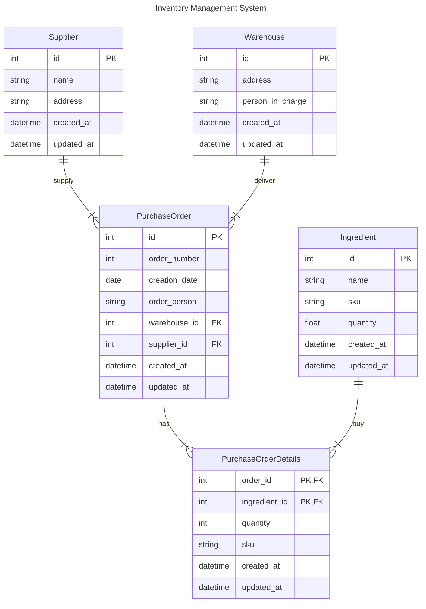

# aspdotnet-core-mvc-101

This repo is where I practice ASP.NET core MVC

## Install EF tool

By default, `dotnet` CLI doesn't include tool to work with EF core for Linux, so you must install the tool by yourself manually.

To install the EF tool globally.

```bash
dotnet tool install --global dotnet-ef
```

Verify the tool using.

```bash
dotnet ef --version
```

## ERD


